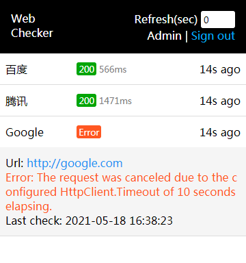

## 概述

WebChecker是一个帮助网站运维人员检查网站是否挂掉的小工具。如果你只是想知道你管理的网站是否挂掉，并且在挂掉时得到通知，而不是想要一个监测网站各项指标的复杂仪表盘的话，这个小工具应该是你需要的。

本程序基于Asp.Net Core 5.0构建，可直接运行exe或部署到IIS等web服务器上，然后通过以下方式获知所管理网站的运行状况：
- 用浏览器（含移动设备）访问应用网址
- 配置邮件通知，当某个网站挂掉/恢复时得到通知

